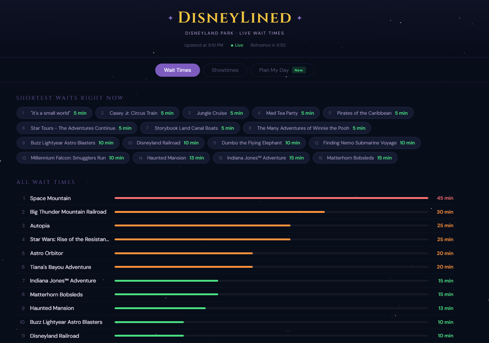

# DisneyLined 🏰

**Live at [disneylined.site](https://disneylined.site)**

A full-stack Disneyland wait time optimizer. It collects live ride data every 10 minutes, predicts future wait times with a machine learning model, and uses a constraint solver to build the optimal route through your day around the rides you care about and the shows you don't want to miss.

Deployed on AWS, collecting data 24/7.



---

## What It Does

### Live wait times
Polls the [themeparks.wiki](https://api.themeparks.wiki) API every 10 minutes during park hours and stores every ride's wait in PostgreSQL. The front page shows current conditions three ways: a shortest-waits strip, a ranked list with animated bars, and a card grid. Waits are color-coded (green under 20 min, amber 20–45, red above), and the page auto-refreshes with a live countdown.

### Showtimes
Pulls the day's entertainment schedule (parades, fireworks, character shows) and groups them by show with upcoming and past highlighting. Refreshes daily before park open.

### Wait time prediction
A shared XGBoost model trained on every collected snapshot predicts the wait for any ride at any time of day. Features include time of day, day of week, month, holidays, a park-wide crowd signal, per-ride rolling averages, and a target-encoded ride identity. The model is cross-validated with `TimeSeriesSplit` to prevent leakage, retrains weekly, and only replaces the production model if it beats the current one.

### Day optimizer
Mark rides as Must / Want / Avoid, pick your shows, set arrival and departure times. A Google OR-Tools CP-SAT solver then builds your itinerary:

- Guarantees must-do rides, packs in as many others as fit
- Schedules each ride at its lowest predicted wait
- Automatically chooses which *showing* of each show fits your day best
- Computes walking time between every stop
- Detects idle gaps and suggests filling them (e.g.a snack break for short gaps, a specific unridden attraction for longer ones)

### Live re-planning
Days never go as planned. As you move through the park, tap rides off as you finish them. Hit **Re-plan from here** and the optimizer rebuilds the rest of your day from your actual current location and the real current time, blending *live* wait times for the next 30 minutes with model predictions beyond that.

---

## Architecture

```
themeparks.wiki API
        │  every 10 min (Airflow)
        ▼
   PostgreSQL ──────────────── grows continuously
        │
        ├──► Airflow: weekly model retraining
        │         │
        │         ▼
        │    XGBoost model  ──► wait time predictions
        │                             │
        ▼                             ▼
   FastAPI backend ◄──────── OR-Tools CP-SAT optimizer
        │
        ▼
   React frontend (wait times · showtimes · day planner)
```

Deployed on a single AWS Lightsail instance running Nginx as a reverse proxy, with FastAPI and Airflow managed as systemd services and HTTPS via Let's Encrypt.

---

## Tech Stack

| Layer | Technology |
|---|---|
| Data collection | Python, Apache Airflow, themeparks.wiki API |
| Database | PostgreSQL, SQLAlchemy |
| Backend | FastAPI, Uvicorn |
| ML | XGBoost, scikit-learn, pandas |
| Optimizer | Google OR-Tools (CP-SAT) |
| Frontend | React, Vite |
| Deployment | AWS Lightsail, Nginx, systemd, Let's Encrypt |

---


## Project Structure

```
DisneyLined/
├── api/                          # FastAPI backend
│   ├── main.py
│   └── routers/
│       ├── rides.py              # GET /api/rides/live
│       ├── shows.py              # GET /api/shows/today
│       └── plans.py              # POST /api/plans + picker endpoints
│
├── dags/                         # Airflow DAGs
│   ├── wait_time_ingestion.py    # every 10 min — ride waits
│   ├── showtime_refresh.py       # daily 8:01am PT — show schedule
│   └── model_retraining.py       # weekly Mon 9am PT — retrain + promote
│
├── data/                         # curated ride/show durations
├── db/                           # SQLAlchemy models + session
├── fetcher/                      # API clients, seeders, backfills
├── ml/                           # feature engineering, training, inference
├── optimizer/
│   ├── planner.py                # greedy + CP-SAT planners, gap detection
│   └── walk_time.py              # haversine walk-time estimator
├── scripts/                      # init_db, data loaders, is_queueable flagging
├── models/                       # trained models (gitignored)
│
└── frontend/
    └── src/components/
        ├── WaitTimesTab.jsx
        ├── ShowtimesTab.jsx
        ├── PlanningTab.jsx
        └── planning/
            ├── RidePicker.jsx
            ├── ShowPicker.jsx
            ├── PlanLoading.jsx
            └── PlanTimeline.jsx
```

---

## Running Locally

### Prerequisites
Python 3.12 · Node.js 18+ · PostgreSQL 15+ · WSL2 if on Windows (Airflow doesn't run natively on Windows)

### Setup

```bash
git clone https://github.com/yourusername/DisneyLined.git
cd DisneyLined
cp .env.example .env          # fill in your PostgreSQL credentials

python3 -m venv venv && source venv/bin/activate
pip install -r requirements.txt
```

Create the database:
```bash
sudo -u postgres psql -c "CREATE DATABASE disney_optimizer;"
sudo -u postgres psql -c "CREATE USER disney_user WITH PASSWORD 'yourpassword';"
sudo -u postgres psql -c "GRANT ALL PRIVILEGES ON DATABASE disney_optimizer TO disney_user;"
sudo -u postgres psql -d disney_optimizer -c "GRANT ALL ON SCHEMA public TO disney_user;"
python scripts/init_db.py
```

Seed reference data (one-time):
```bash
python fetcher/seed_rides.py
python fetcher/seed_shows.py
python fetcher/backfill_ride_locations.py
python fetcher/backfill_show_locations.py
python scripts/load_ride_durations.py
python scripts/load_show_durations.py
python scripts/flag_non_queueable.py
```

Start Airflow and enable the DAGs:
```bash
export AIRFLOW_HOME=~/airflow
export PYTHONPATH=$(pwd)
airflow standalone            # UI at localhost:8080

mkdir -p ~/airflow/dags
ln -s $(pwd)/dags/*.py ~/airflow/dags/
```

Once some data has accumulated, train the first model:
```bash
python ml/train.py
```

Run it:
```bash
uvicorn api.main:app --reload --port 8000     # terminal 1
cd frontend && npm install && npm run dev     # terminal 2
```

Open `http://localhost:5173`.

---

## API Reference

| Endpoint | Method | Description |
|---|---|---|
| `/api/rides/live` | GET | Latest wait time snapshot for all queueable rides |
| `/api/shows/today` | GET | Today's show schedule grouped by show |
| `/api/plans/rides` | GET | Rides available for planning |
| `/api/plans/shows` | GET | Shows with today's showtimes |
| `/api/plans` | POST | Generate (or re-generate) an optimized day plan |
| `/health` | GET | API health check |

---

## Roadmap

- [x] PostgreSQL schema + Airflow data pipeline
- [x] FastAPI backend, React frontend
- [x] XGBoost wait prediction with weekly retraining and model promotion
- [x] OR-Tools CP-SAT optimizer with priority tiers and automatic showtime selection
- [x] Walk-time estimation and gap-filling suggestions
- [x] Live re-planning with blended live/predicted waits
- [x] Deployed to AWS with 24/7 data collection

## Future goals
- [ ] Multi-park support (Disney California Adventure)
- [ ] Mobile-first UI pass

---

## Acknowledgements

Live park data provided by [themeparks.wiki](https://themeparks.wiki), an open-source community project. Not affiliated with or endorsed by The Walt Disney Company.
